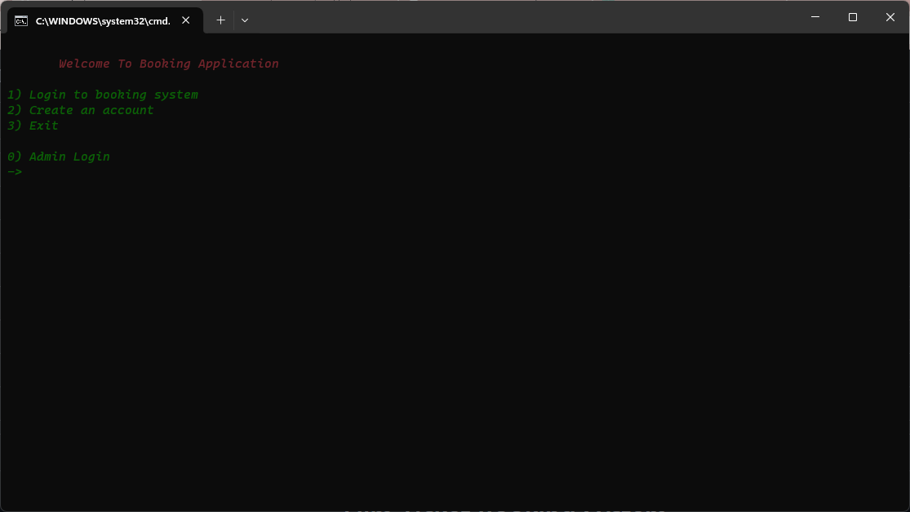
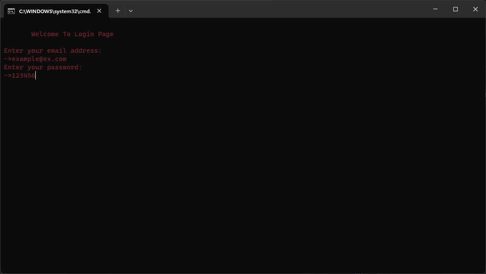
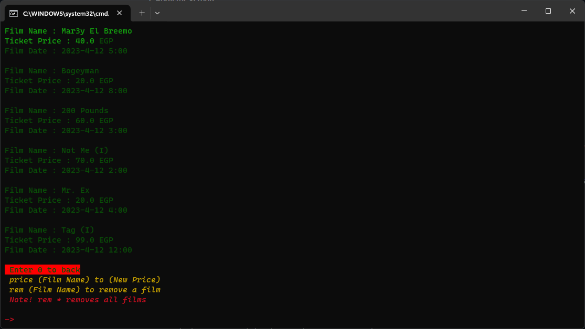

# Film Ticket Booking System

This project manages the ticket booking process of a theater, providing a user-friendly terminal for booking film tickets efficiently. With a focus on consistency, reliability, and accuracy, the system incorporates well-designed forms with validations to ensure data integrity stored in JSON files.

## Solution Design

The architecture revolves around two main components:

- **User Side**
- **Admin Side**

### User Side

This segment is dedicated to users who utilize the application for booking tickets. It includes:

- Film control (add, remove, edit ticket price)
- Clients control (add, remove, view client bookings, display client information)
- Overview of payment transactions within the system

1. **Home Screen**

   Upon opening the application or running `main.py`, users encounter the home screen. If it's their first time, they can register; otherwise, they can login with their credentials to proceed.

   

2. **Register Screen**

   First-time users can register using their email ID and password on this screen.

   

3. **Login Screen**

   Returning users can directly login using their credentials to initiate the booking process.

   

4. **Now Showing Screen**

   Following the login/registration, users are presented with options like adding films to the cart, confirming or canceling bookings, and managing their film selections.

   - Adding films to the cart displays a list with film details such as Film Name, Description, Ticket Price, and Show Date.

   

   - Control options allow for removing film tickets from the cart and confirming client payments.

   

### Admin Side

This segment caters to the admin or theater owner/booking counter. Admin privileges include:

- Managing film details (add, remove, edit prices)
- Managing client bookings (add, remove, view booked sets)

## Implementation Plan

The project is implemented using Python, leveraging JSON for data management to store client, admin, film, reservation, and transaction data.

## How to Run Locally

1. Navigate to the project folder on your system.
2. Execute `Booking System.cmd` to run the application.

- Karim Omar
